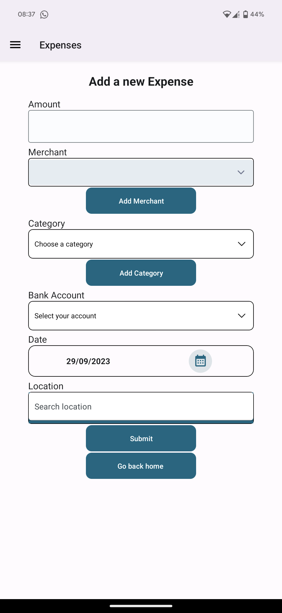
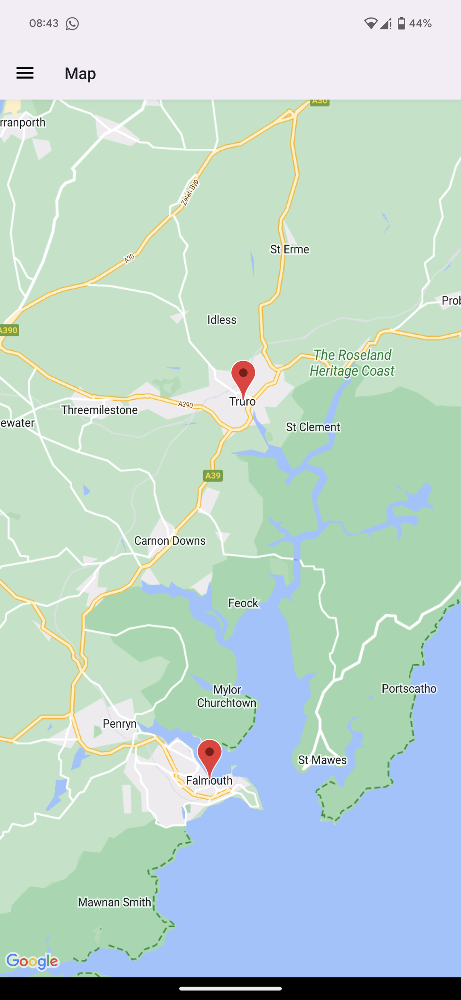

**Xpensio**



Xpensio is a React Native app that aims to help people keep track of their expenses. It was inspired by the prevailing cost of living crisis in our economy, and we thought it would be a great way to empower people to keep track of their everyday spending and improve their financial health.

Users can add expenses, scan their receipts, and get a detailed breakdown of their spending through our analysis charts and maps.

---

How to Run Xpensio Locally

You will need an Android device or an emulator to run Xpensio.

✔️ **1. How to clone the repo**


Terminal Commands:

```
$ git clone https://github.com/zamarz/expense-tracker
$ cd expense-tracker
$ code .
```

✔️ **2. Install the dependencies**


```
$ npm install
```

✔️ **3. Set up your connection to Firebase**


You will have to set up your own connection to Firebase to use the app. See the official documentation for more information.

✔️ **4. How to use our app**


To play around with our app, simply start your local server using:

```
npx expo start
```

In your terminal, a prompt will tell you that you can view the app from your web browser, however it only works on Android phones. Simply scan the QR code that appears with the Expo Go app and it will launch the project on your mobile device.

**Node.js and Expo**

 

This project was created using:

```
$ node -v | v20.2.0
```

**Xpensio**

Xpensio is a team comprised of [Beth Hughes](https://github.com/Beth-H-coder), [Isabel Popa](https://github.com/isabelpopa), [Pedro Ferreira](https://github.com/prgf87), [Sunil Krishna Yelamanchili](https://github.com/sunilkrishna49) and [Zach Marzouk](https://github.com/zamarz).
